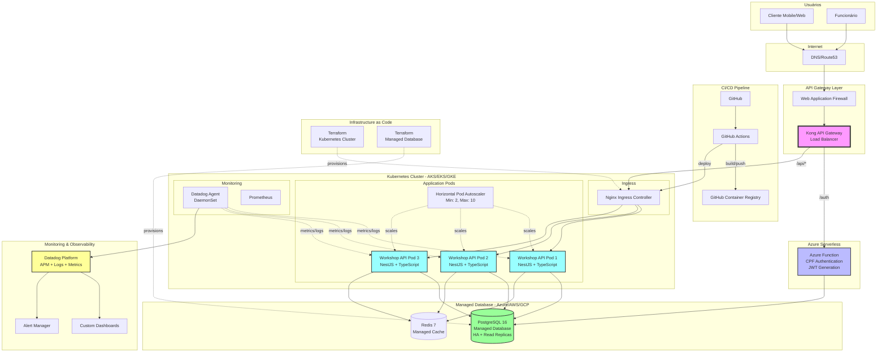

# Diagrama de Componentes - Sistema de Oficina Mecânica

## Visão Geral da Arquitetura em Nuvem



## Detalhamento dos Componentes

### 1. Camada de Entrada
- **DNS**: Gerenciamento de domínios e roteamento
- **WAF**: Proteção contra ataques web (SQL Injection, XSS, etc)
- **Kong API Gateway**: 
  - Rate limiting (100 req/min por IP)
  - JWT validation
  - Request/Response transformation
  - Correlation ID injection
  - CORS handling

### 2. Autenticação Serverless
- **Azure Function**:
  - Trigger HTTP POST
  - Validação de CPF (algoritmo completo)
  - Consulta PostgreSQL
  - Geração JWT (HS256)
  - Cold start: ~200ms
  - Warm: ~50ms

### 3. Cluster Kubernetes
- **Managed Kubernetes**: AKS (Azure), EKS (AWS) ou GKE (Google)
- **Namespace**: `workshop` (isolamento lógico)
- **Ingress**: Nginx para roteamento interno
- **HPA**: Escala baseado em CPU (70%) e Memória (80%)
- **Resources**:
  - Request: 250m CPU, 512Mi RAM
  - Limit: 500m CPU, 1Gi RAM

### 4. Aplicação (NestJS)
- **Clean Architecture** (4 camadas)
- **Domain-Driven Design**
- **SOLID Principles**
- **844 testes automatizados**
- **Swagger/OpenAPI**
- **Health checks**: `/health`

### 5. Banco de Dados Gerenciado
- **PostgreSQL 16**:
  - HA (High Availability) com failover automático
  - Read replicas para leitura
  - Backup diário com retenção de 30 dias
  - Point-in-time recovery
  - SSL/TLS obrigatório
- **Redis 7**:
  - Cache de sessões
  - Cache de queries frequentes
  - TTL configurável

### 6. Monitoramento (Datadog)
- **APM**: Traces distribuídos
- **Logs**: Agregação e parsing
- **Metrics**: Custom + System
- **Dashboards**: 5 dashboards principais
- **Alerts**: 13 alertas configurados
- **SLA**: 99.9% uptime

### 7. CI/CD
- **GitHub Actions**:
  - Build automático
  - Testes (unit + integration + e2e)
  - Security scan (Trivy)
  - Docker build & push
  - Deploy Kubernetes
  - Rollback automático

### 8. Infrastructure as Code
- **Terraform**:
  - Cluster Kubernetes
  - Managed PostgreSQL
  - Redis
  - Networking (VPC, Subnets, Security Groups)
  - IAM/RBAC

## Fluxos de Dados

### Fluxo de Autenticação
```
Cliente -> Kong -> Azure Function -> PostgreSQL -> JWT -> Cliente
```

### Fluxo de Requisição Protegida
```
Cliente -> Kong (JWT validation) -> Ingress -> API Pod -> PostgreSQL -> Response
```

### Fluxo de Monitoramento
```
API Pod -> Datadog Agent -> Datadog Platform -> Dashboard/Alerts
```

## Escalabilidade

### Horizontal Pod Autoscaler
- **Min Replicas**: 2
- **Max Replicas**: 10
- **Métricas**:
  - CPU > 70% → Scale up
  - Memory > 80% → Scale up
  - CPU < 30% (5 min) → Scale down

### Database Scaling
- **Vertical**: Aumentar CPU/RAM da instância
- **Horizontal**: Read replicas para queries de leitura
- **Connection Pooling**: Prisma (max 10 conexões por pod)

## Alta Disponibilidade

### Application Layer
- Múltiplos pods (min 2)
- Health checks (liveness + readiness)
- Graceful shutdown (30s)
- Zero-downtime deployments (rolling update)

### Database Layer
- HA nativo do managed database
- Failover automático (< 30s)
- Backups diários
- Point-in-time recovery

### Network Layer
- Load balancer com health checks
- Multi-AZ deployment
- DDoS protection

## Segurança

### Network
- VPC isolada
- Security Groups restritivos
- TLS/SSL obrigatório
- Private subnets para database

### Application
- JWT authentication
- Role-based access control (RBAC)
- Input validation (class-validator)
- SQL injection prevention (Prisma)
- Rate limiting (Kong)

### Secrets Management
- Kubernetes Secrets
- Azure Key Vault / AWS Secrets Manager
- Rotação automática de credentials
- Encryption at rest

## Custos Estimados (Mensal)

| Componente | Recurso | Custo (USD) |
|------------|---------|-------------|
| Kubernetes | 3 nodes (2 vCPU, 4GB) | $150 |
| PostgreSQL | Managed DB (4 vCPU, 16GB) | $300 |
| Redis | Managed Cache (2GB) | $50 |
| Azure Function | 1M executions | $0.20 |
| Load Balancer | Standard | $25 |
| Datadog | Pro plan (10 hosts) | $150 |
| Bandwidth | 1TB egress | $90 |
| **Total** | | **~$765** |

## Próximos Passos

1. ✅ Implementar API Gateway (Kong)
2. ✅ Configurar Azure Function
3. ✅ Setup Datadog
4. ✅ CI/CD completo
5. 🔄 Multi-region deployment
6. 🔄 Disaster recovery plan
7. 🔄 Performance testing (load tests)
