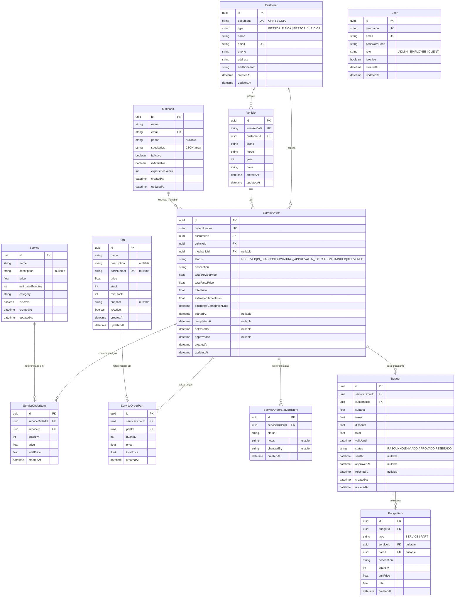

# Diagrama ER — Mechanical Workshop

Diagrama Entity-Relationship completo do banco de dados PostgreSQL da aplicação.

## Diagrama Principal

---

## Descrição dos Relacionamentos

### `Customer` → `Vehicle` (1:N)
- Um cliente pode ter **múltiplos veículos**
- Um veículo pertence a **um único cliente**
- `ON DELETE CASCADE`: remover veículos ao remover cliente

### `Customer` → `ServiceOrder` (1:N)
- Um cliente pode ter **múltiplas ordens de serviço** abertas ao longo do tempo
- Permite rastrear histórico completo por cliente

### `Vehicle` → `ServiceOrder` (1:N)
- Um veículo pode ter **múltiplas OS** ao longo do tempo
- Permite rastrear histórico de manutenção por veículo

### `Mechanic` → `ServiceOrder` (1:N, opcional)
- Um mecânico pode estar responsável por **múltiplas OS**
- A relação é **nullable** (OS pode estar sem mecânico atribuído ainda)

### `ServiceOrder` → `ServiceOrderItem` (1:N) — tabela de junção com `Service`
- Uma OS pode ter **múltiplos serviços**
- Um serviço pode aparecer em **múltiplas OS**
- A tabela intermediária armazena `quantity`, `price` e `totalPrice` **no momento da OS** (histórico imutável)

### `ServiceOrder` → `ServiceOrderPart` (1:N) — tabela de junção com `Part`
- Uma OS pode utilizar **múltiplas peças**
- Uma peça pode ser usada em **múltiplas OS**
- Quantidade e preço armazenados na OS (snapshot)

### `ServiceOrder` → `ServiceOrderStatusHistory` (1:N)
- Auditoria completa de todas as transições de status
- Registra quem fez a mudança (`changedBy`) e notas opcionais

### `ServiceOrder` → `Budget` (1:N)
- Uma OS pode gerar **múltiplos orçamentos** (rascunhos, revisões)
- Orçamento tem ciclo de vida próprio (RASCUNHO → ENVIADO → APROVADO/REJEITADO)

### `Budget` → `BudgetItem` (1:N)
- Um orçamento é composto de **múltiplos itens**
- Cada item pode referenciar um `Service` ou uma `Part`

---

## Índices Estratégicos

| Tabela | Campo(s) | Justificativa |
|---|---|---|
| `customers` | `document` | Busca por CPF/CNPJ (autenticação) |
| `customers` | `email` | Unique constraint |
| `vehicles` | `licensePlate` | Busca por placa |
| `vehicles` | `customerId` | JOIN frequente |
| `service_orders` | `customerId` | Listar OS por cliente |
| `service_orders` | `vehicleId` | Listar OS por veículo |
| `service_orders` | `status` | Filtros de status (dashboard) |
| `service_orders` | `createdAt DESC` | Paginação cronológica |
| `service_orders` | `mechanicId` | Listar OS por mecânico |
| `service_order_items` | `serviceOrderId` | Cascade delete + JOIN |
| `service_order_parts` | `serviceOrderId` | Cascade delete + JOIN |
| `parts` | `partNumber` | Busca por código de peça |
| `mechanics` | `email` | Unique constraint |
| `users` | `username`, `email` | Autenticação interna |

---

## Decisão de Design

Para detalhes sobre a escolha do PostgreSQL, estratégias de escalabilidade e comparação com alternativas, consulte:

- [ADR-002: PostgreSQL como Banco Principal](./ADR-002-POSTGRESQL-DATABASE.md)
