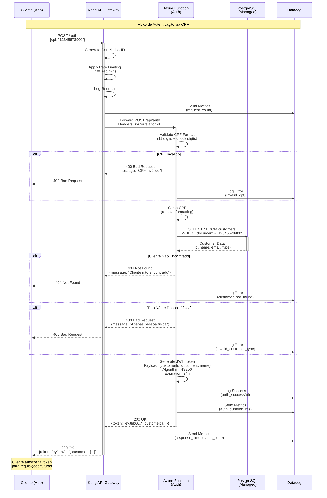
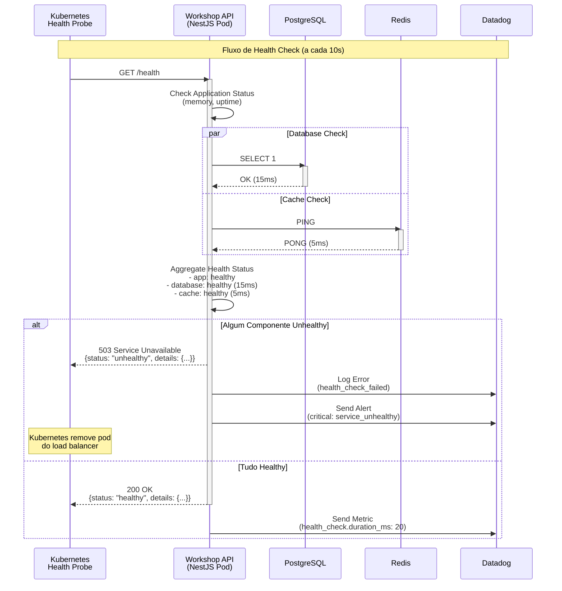

# Diagrama de Sequência - Autenticação e Criação de Ordem de Serviço

## 1. Fluxo de Autenticação via CPF



## 2. Fluxo de Criação de Ordem de Serviço (Protegido)

```mermaid
sequenceDiagram
    participant C as Cliente (App)
    participant K as Kong API Gateway
    participant I as Kubernetes<br/>Ingress
    participant A as Workshop API<br/>(NestJS Pod)
    participant DB as PostgreSQL
    participant R as Redis
    participant DD as Datadog

    Note over C,DD: Fluxo de Criação de Ordem de Serviço
    
    C->>K: POST /service-orders<br/>Headers: Authorization: Bearer <token><br/>Body: {vehicleId, services[], parts[]}
    activate K
    
    K->>K: Generate Correlation-ID<br/>(if not present)
    K->>K: Apply Rate Limiting
    
    K->>K: Validate JWT Token<br/>Algorithm: HS256<br/>Check expiration<br/>Verify signature
    
    alt Token Inválido ou Expirado
        K-->>C: 401 Unauthorized<br/>{message: "Token inválido"}
        K->>DD: Log Error<br/>(invalid_token)
    end
    
    K->>K: Extract JWT Claims<br/>(customerId, document, name)
    
    K->>DD: Send Metrics<br/>(jwt_validation_success)
    
    K->>I: Forward POST /service-orders<br/>Headers: X-User-ID, X-Correlation-ID
    activate I
    
    I->>I: Route to Pod<br/>(Load Balance)
    
    I->>A: POST /service-orders
    activate A
    
    A->>A: Start APM Trace<br/>Span: create_service_order
    
    A->>A: Validate DTO<br/>(class-validator)<br/>- vehicleId required<br/>- services array not empty
    
    alt Validação Falha
        A-->>I: 400 Bad Request<br/>{errors: [...]}
        I-->>K: 400 Bad Request
        K-->>C: 400 Bad Request
        A->>DD: Log Error<br/>(validation_error)
    end
    
    A->>DB: BEGIN TRANSACTION
    activate DB
    
    A->>DB: SELECT * FROM vehicles<br/>WHERE id = vehicleId<br/>AND customer_id = customerId
    DB-->>A: Vehicle Data
    
    alt Veículo Não Encontrado
        A->>DB: ROLLBACK
        A-->>I: 404 Not Found
        I-->>K: 404 Not Found
        K-->>C: 404 Not Found
        deactivate DB
    end
    
    A->>DB: SELECT * FROM services<br/>WHERE id IN (...)
    DB-->>A: Services Data<br/>[{id, name, price, estimatedTime}]
    
    A->>DB: SELECT * FROM parts<br/>WHERE id IN (...)
    DB-->>A: Parts Data<br/>[{id, name, price, stockQuantity}]
    
    A->>A: Calculate Budget<br/>totalServices = SUM(services.price)<br/>totalParts = SUM(parts.price * qty)<br/>totalBudget = totalServices + totalParts
    
    A->>A: Calculate Estimated Time<br/>totalTime = SUM(services.estimatedTime)
    
    A->>DB: INSERT INTO service_orders<br/>(id, vehicle_id, customer_id, status,<br/>total_budget, estimated_time, created_at)
    DB-->>A: Service Order Created<br/>{id: "uuid"}
    
    A->>DB: INSERT INTO service_order_services<br/>(service_order_id, service_id, quantity, price)
    DB-->>A: Relations Created
    
    A->>DB: INSERT INTO service_order_parts<br/>(service_order_id, part_id, quantity, price)
    DB-->>A: Relations Created
    
    A->>DB: UPDATE parts<br/>SET stock_quantity = stock_quantity - qty<br/>WHERE id IN (...)
    DB-->>A: Stock Updated
    
    A->>DB: COMMIT TRANSACTION
    deactivate DB
    
    A->>R: SET service_order:uuid<br/>VALUE: {...}<br/>EX: 3600
    activate R
    R-->>A: OK
    deactivate R
    
    A->>A: Publish Event<br/>ServiceOrderCreated<br/>(for notifications)
    
    A->>DD: Send Custom Metric<br/>service_orders.created<br/>Tags: [status:pending, customer_id]
    
    A->>DD: Send Custom Metric<br/>service_orders.budget_value<br/>Value: totalBudget
    
    A->>DD: End APM Trace<br/>Duration: 145ms<br/>Tags: [status:success, customer_id]
    
    A-->>I: 201 Created<br/>{id, vehicleId, status: "PENDING",<br/>totalBudget, estimatedTime, services[], parts[]}
    deactivate A
    
    I-->>K: 201 Created
    deactivate I
    
    K->>DD: Send Metrics<br/>(response_time: 150ms, status: 201)
    
    K-->>C: 201 Created<br/>{serviceOrder: {...}}
    deactivate K
    
    Note over C: Cliente recebe confirmação<br/>e orçamento detalhado
    
    Note over A: Notificação enviada<br/>assincronamente (email)
```

## 3. Fluxo de Health Check com Monitoramento



## Elementos de Observabilidade

### Correlation ID
- Gerado no Kong Gateway
- Propagado em todos os serviços
- Permite rastreamento end-to-end
- Formato: UUID v4

### APM Traces (Datadog)
- **Root Span**: Request no Kong
- **Child Spans**:
  - JWT Validation
  - Database Query
  - Redis Operation
  - Business Logic
  - Response Serialization

### Custom Metrics
```typescript
// Exemplo de instrumentação
dogstatsd.increment('service_orders.created', 1, [
  'status:pending',
  'customer_id:123',
  'correlation_id:abc'
]);

dogstatsd.timing('service_orders.processing_time', duration, [
  'status:completed'
]);

dogstatsd.gauge('database.connections.active', activeConnections);
```

### Logs Estruturados
```json
{
  "timestamp": "2024-03-15T10:30:45.123Z",
  "level": "info",
  "correlationId": "abc-123-def-456",
  "userId": "user-123",
  "customerId": "customer-456",
  "method": "POST",
  "path": "/service-orders",
  "statusCode": 201,
  "duration": 145,
  "message": "Service order created successfully",
  "serviceOrderId": "so-789"
}
```

## Tempos de Resposta (SLA)

| Operação | p50 | p95 | p99 | Max |
|-----------|-----|-----|-----|-----|
| Autenticação | 80ms | 150ms | 250ms | 500ms |
| Criar OS | 120ms | 200ms | 350ms | 1s |
| Listar OS | 50ms | 100ms | 200ms | 500ms |
| Health Check | 10ms | 20ms | 30ms | 50ms |

## Pontos de Falha e Recuperação

### 1. Azure Function Timeout
- **Timeout**: 5 minutos (configurável)
- **Retry**: Cliente deve retentar (idempotente via CPF)

### 2. Database Connection Failed
- **Retry**: 3 tentativas com backoff exponencial
- **Circuit Breaker**: Após 5 falhas consecutivas
- **Fallback**: Retornar 503 Service Unavailable

### 3. Redis Cache Miss
- **Fallback**: Consultar diretamente no PostgreSQL
- **Cache Warming**: Popular cache após query

### 4. Pod Crash
- **Kubernetes**: Reinicia pod automaticamente
- **Graceful Shutdown**: 30s para finalizar requests
- **Health Checks**: Remove do load balancer

## Segurança em Camadas

1. **Network**: WAF + TLS/SSL
2. **Gateway**: Rate limiting + JWT validation
3. **Application**: RBAC + Input validation
4. **Database**: Prepared statements + Encryption at rest
