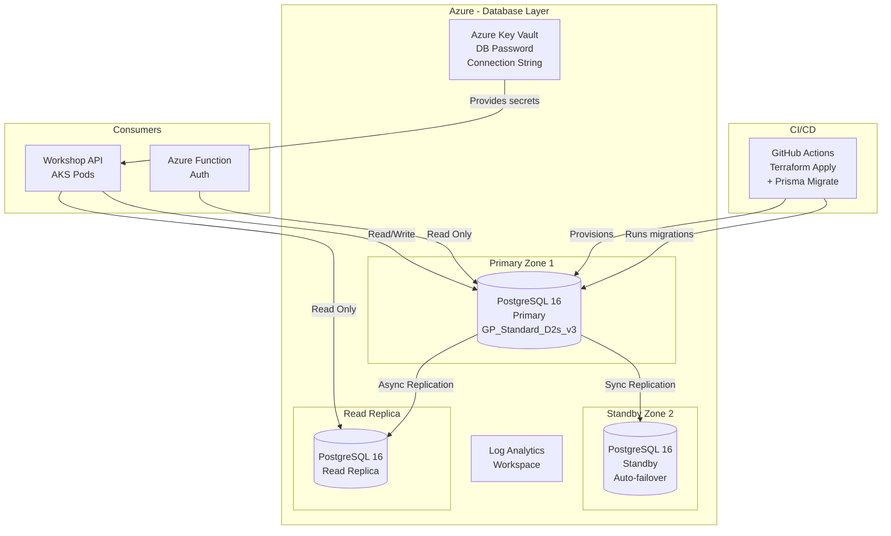

# 🗄️ Infraestrutura de Banco de Dados — Mechanical Workshop

Repositório de infraestrutura como código (IaC) para provisionar o **Azure Database for PostgreSQL Flexible Server** gerenciado para a aplicação Mechanical Workshop.

---

## 📋 Propósito

Provisionar e gerenciar toda a infraestrutura de banco de dados:

- Azure Database for PostgreSQL 16 (Flexible Server)
- Alta Disponibilidade com failover automático (Zone Redundant)
- Read Replicas para consultas de leitura
- Backup automático (35 dias de retenção)
- Point-in-time recovery
- Azure Key Vault para gerenciamento de segredos
- Log Analytics integrado
- Firewall rules e Private Endpoint

---

## 🛠️ Tecnologias

| Ferramenta | Versão | Propósito |
|---|---|---|
| Terraform | 1.6+ | Provisionamento IaC |
| Azure Provider (azurerm) | ~> 3.0 | Recursos Azure |
| PostgreSQL | 16 | Banco de dados relacional |
| Azure Key Vault | Standard | Gerenciamento de segredos |
| Prisma | 5.x | ORM + Migrations |
| Log Analytics | Managed | Logs e diagnósticos |

---

## 📁 Estrutura

```
terraform-database/
├── .github/
│   └── workflows/
│       └── terraform.yml       # CI/CD: plan em PR, apply + migration no merge
├── prisma/
│   ├── schema.prisma            # Schema do banco (fonte da verdade)
│   └── migrations/              # Histórico de migrations
├── main.tf                      # Recursos principais (PostgreSQL, Key Vault)
├── variables.tf                 # Definição de variáveis
├── outputs.tf                   # Outputs (connection string, server FQDN)
├── provider.tf                  # Provider Azure + versões
├── terraform.tfvars.example     # Exemplo de variáveis
└── README.md
```

---

## 🏛️ Diagrama de Arquitetura



---

## ⚙️ Pré-requisitos

- [Terraform](https://developer.hashicorp.com/terraform/install) >= 1.6
- [Azure CLI](https://docs.microsoft.com/cli/azure/install-azure-cli) >= 2.50
- [Node.js](https://nodejs.org/) >= 20 (para Prisma migrations)
- Conta Azure com permissão de `Contributor`
- Service Principal configurado

---

## 🚀 Deploy Manual

### 1. Autenticar no Azure

```bash
az login
az account set --subscription "<SUBSCRIPTION_ID>"
```

### 2. Configurar variáveis

```bash
cp terraform.tfvars.example terraform.tfvars
# Edite terraform.tfvars com seus valores
```

Exemplo de `terraform.tfvars`:

```hcl
resource_group_name          = "mechanical-workshop-rg"
location                     = "East US"
server_name                  = "mechanical-workshop-db"
database_name                = "workshop"
admin_username               = "workshopadmin"
sku_name                     = "GP_Standard_D2s_v3"
storage_mb                   = 32768
backup_retention_days        = 35
geo_redundant_backup_enabled = true
high_availability_mode       = "ZoneRedundant"
postgresql_version           = "16"
environment                  = "production"
```

### 3. Inicializar Terraform

```bash
terraform init \
  -backend-config="resource_group_name=terraform-state-rg" \
  -backend-config="storage_account_name=tfstateworkshop" \
  -backend-config="container_name=tfstate" \
  -backend-config="key=database.tfstate"
```

### 4. Planejar e aplicar

```bash
terraform plan -out=tfplan
terraform apply tfplan
```

### 5. Executar migrations Prisma

```bash
# Obter connection string do Key Vault
CONNECTION_STRING=$(az keyvault secret show \
  --vault-name mechanical-workshop-db-kv \
  --name database-connection-string \
  --query value -o tsv)

# Executar migrations
DATABASE_URL="$CONNECTION_STRING" npx prisma migrate deploy
```

---

## 🔄 CI/CD (GitHub Actions)

O workflow `.github/workflows/terraform.yml` executa automaticamente:

| Trigger | Ação |
|---|---|
| Pull Request para `main` ou `develop` | `terraform plan` (comentado no PR) |
| Merge para `develop` | `terraform apply` → staging + `prisma migrate deploy` |
| Merge para `main` | `terraform apply` → production + `prisma migrate deploy` |

### Secrets necessários no GitHub

| Secret | Descrição |
|---|---|
| `AZURE_CREDENTIALS` | JSON da Service Principal |
| `AZURE_CLIENT_ID` | Client ID da SP |
| `AZURE_CLIENT_SECRET` | Client Secret da SP |
| `AZURE_SUBSCRIPTION_ID` | ID da subscription |
| `AZURE_TENANT_ID` | ID do tenant |
| `AZURE_KEY_VAULT_NAME` | Nome do Key Vault |

---

## 📊 Recursos Provisionados

| Recurso | Tipo | Configuração |
|---|---|---|
| PostgreSQL Flexible Server | `azurerm_postgresql_flexible_server` | v16, GP_Standard_D2s_v3 (2 vCPU, 8 GB) |
| Database | `azurerm_postgresql_flexible_server_database` | `workshop`, UTF8 |
| High Availability | Zone Redundant | Standby na Zona 2 |
| Backup | Automático | 35 dias, geo-redundante |
| Key Vault | `azurerm_key_vault` | Standard, senha + connection string |
| Log Analytics | `azurerm_log_analytics_workspace` | 30 dias retenção |
| Diagnostic Settings | PostgreSQL Logs + AllMetrics | Integrado ao Log Analytics |
| Firewall Rule | Allow Azure Services | `0.0.0.0 - 0.0.0.0` |

---

## 🗺️ Modelo de Dados

O schema completo está em `prisma/schema.prisma`. As entidades principais são:

```
Customer (1) ──── (N) Vehicle
Vehicle   (1) ──── (N) ServiceOrder
ServiceOrder (N) ── (M) Service   [via ServiceOrderService]
ServiceOrder (N) ── (M) Part      [via ServiceOrderPart]
```

> Veja o diagrama ER completo em [docs/ddd/ER-DIAGRAM.md](https://github.com/[org]/mechanical-workshop-api/blob/main/docs/ddd/ER-DIAGRAM.md)

---

## 🔐 Segurança

- **Senha gerada aleatoriamente** (32 chars, caracteres especiais) via `random_password`
- **Armazenada no Azure Key Vault** — nunca exposta em código
- **SSL/TLS obrigatório** em todas as conexões
- **Firewall**: apenas serviços Azure e Private Endpoint do AKS
- **Branch `main` protegida**: PRs obrigatórios + aprovação + CI verde

---

## 🌍 Ambientes

| Branch | Ambiente | Workspace Terraform | Banco |
|---|---|---|---|
| `develop` | staging | `staging` | `workshop_staging` |
| `main` | production | `production` | `workshop` |

---

## 🔙 Rollback de Migration

Em caso de problemas:

```bash
# Listar migrations aplicadas
DATABASE_URL="..." npx prisma migrate status

# Reverter manualmente usando SQL
psql "$DATABASE_URL" -f rollback.sql
```

---

## 📚 Documentação Relacionada

- [Diagrama ER Completo](https://github.com/[org]/mechanical-workshop-api/blob/main/docs/ddd/ER-DIAGRAM.md)
- [ADR-002: PostgreSQL como Banco Principal](https://github.com/[org]/mechanical-workshop-api/blob/main/docs/ddd/ADR-002-POSTGRESQL-DATABASE.md)
- [RFC-001: Escolha da Plataforma de Nuvem](https://github.com/[org]/mechanical-workshop-api/blob/main/docs/ddd/RFC-001-CLOUD-PLATFORM.md)

---

## 🤝 Contribuição

1. Crie uma branch a partir de `develop`
2. Faça as alterações no Terraform ou schema Prisma
3. Abra um Pull Request para `develop`
4. Aguarde revisão e CI verde (terraform plan sem erros)
5. Merge é feito pelo responsável técnico

**Branch `main` é protegida — commits diretos não são permitidos.**
