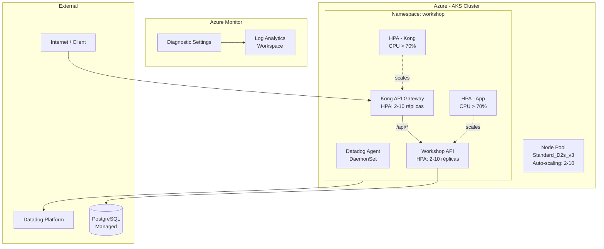

# 🏗️ Infraestrutura Kubernetes — Mechanical Workshop

Repositório de infraestrutura como código (IaC) para provisionar o cluster **Azure Kubernetes Service (AKS)** e aplicar os manifestos K8s da aplicação Mechanical Workshop.

---

## 📋 Propósito

Provisionar e gerenciar toda a infraestrutura de orquestração de contêineres:

- Cluster AKS com auto-scaling (2–10 nodes)
- Namespace `workshop` isolado
- Kong API Gateway (2–10 réplicas + HPA)
- Horizontal Pod Autoscaler para a aplicação
- Datadog Agent (DaemonSet)
- Ingress Controller (Nginx)
- Log Analytics Workspace integrado ao AKS

---

## 🛠️ Tecnologias

| Ferramenta | Versão | Propósito |
|---|---|---|
| Terraform | 1.6+ | Provisionamento IaC |
| Azure Provider | ~> 3.0 | Recursos Azure |
| Kubernetes | 1.28.x | Orquestração de contêineres |
| AKS | Managed | Cluster gerenciado |
| Kong Gateway | 3.x | API Gateway + Rate Limiting |
| Datadog Agent | Latest | Monitoramento e APM |
| Helm | 3.x | Package manager K8s |

---

## 📁 Estrutura

```
terraform-kubernetes/
├── .github/
│   └── workflows/
│       └── terraform.yml       # CI/CD: plan em PR, apply no merge
├── k8s/
│   ├── namespace.yaml           # Namespace 'workshop'
│   ├── deployment.yaml          # App deployment (NestJS)
│   ├── service.yaml             # Service (ClusterIP)
│   ├── hpa.yaml                 # Horizontal Pod Autoscaler
│   ├── configmap.yaml           # Variáveis de ambiente
│   ├── secret.yaml              # Secrets (JWT, DB URL)
│   ├── kong-config.yaml         # Configuração declarativa Kong
│   ├── kong-deployment.yaml     # Kong Deployment + HPA
│   └── datadog-monitoring.yaml  # Datadog DaemonSet
├── main.tf                      # Recursos principais (AKS, Log Analytics)
├── variables.tf                 # Definição de variáveis
├── outputs.tf                   # Outputs (kubeconfig, cluster_id)
├── provider.tf                  # Provider Azure + versões
├── terraform.tfvars.example     # Exemplo de variáveis
└── README.md
```

---

## 🏛️ Diagrama de Arquitetura



---

## ⚙️ Pré-requisitos

- [Terraform](https://developer.hashicorp.com/terraform/install) >= 1.6
- [Azure CLI](https://docs.microsoft.com/cli/azure/install-azure-cli) >= 2.50
- [kubectl](https://kubernetes.io/docs/tasks/tools/) >= 1.28
- Conta Azure com permissão de `Contributor`
- Service Principal configurado (para CI/CD)

---

## 🚀 Deploy Manual

### 1. Autenticar no Azure

```bash
az login
az account set --subscription "<SUBSCRIPTION_ID>"
```

### 2. Configurar variáveis

```bash
cp terraform.tfvars.example terraform.tfvars
# Edite terraform.tfvars com seus valores
```

### 3. Inicializar Terraform

```bash
terraform init \
  -backend-config="resource_group_name=terraform-state-rg" \
  -backend-config="storage_account_name=tfstateworkshop" \
  -backend-config="container_name=tfstate" \
  -backend-config="key=kubernetes.tfstate"
```

### 4. Planejar e aplicar

```bash
terraform plan -out=tfplan
terraform apply tfplan
```

### 5. Obter credenciais do cluster

```bash
az aks get-credentials \
  --resource-group mechanical-workshop-rg \
  --name mechanical-workshop-aks
```

### 6. Aplicar manifestos K8s

```bash
kubectl apply -f k8s/namespace.yaml
kubectl apply -f k8s/configmap.yaml
kubectl apply -f k8s/secret.yaml
kubectl apply -f k8s/deployment.yaml
kubectl apply -f k8s/service.yaml
kubectl apply -f k8s/hpa.yaml
kubectl apply -f k8s/kong-config.yaml
kubectl apply -f k8s/kong-deployment.yaml
kubectl apply -f k8s/datadog-monitoring.yaml
```

### 7. Verificar status

```bash
kubectl get pods -n workshop
kubectl get hpa -n workshop
kubectl get svc -n workshop
```

---

## 🔄 CI/CD (GitHub Actions)

O workflow `.github/workflows/terraform.yml` executa automaticamente:

| Trigger | Ação |
|---|---|
| Pull Request para `main` ou `develop` | `terraform plan` (comentado no PR) |
| Merge para `develop` | `terraform apply` → staging |
| Merge para `main` | `terraform apply` → production |

### Secrets necessários no GitHub

| Secret | Descrição |
|---|---|
| `AZURE_CREDENTIALS` | JSON da Service Principal |
| `AZURE_CLIENT_ID` | Client ID da SP |
| `AZURE_CLIENT_SECRET` | Client Secret da SP |
| `AZURE_SUBSCRIPTION_ID` | ID da subscription |
| `AZURE_TENANT_ID` | ID do tenant |
| `DD_API_KEY` | Datadog API Key |

---

## 📊 Recursos Provisionados

| Recurso | Tipo | Configuração |
|---|---|---|
| AKS Cluster | `azurerm_kubernetes_cluster` | 1.28.x, auto-scaling 2–10 nodes |
| Node Pool | `VirtualMachineScaleSets` | Standard_D2s_v3 (2 vCPU, 8 GB) |
| Log Analytics | `azurerm_log_analytics_workspace` | 30 dias retenção |
| Diagnostic Settings | `azurerm_monitor_diagnostic_setting` | API Server, Controller, Scheduler |

---

## 🔐 Segurança

- **RBAC** habilitado no AKS
- **Network Policy**: Azure CNI
- **Secrets** gerenciados via Azure Key Vault (integração via CSI Driver)
- **Branch `main` protegida**: PRs obrigatórios + aprovação + CI verde

---

## 🌍 Ambientes

| Branch | Ambiente | Workspace Terraform |
|---|---|---|
| `develop` | staging | `staging` |
| `main` | production | `production` |

---

## 📚 Documentação Relacionada

- [Diagrama de Componentes](https://github.com/[org]/mechanical-workshop-api/blob/main/docs/ddd/COMPONENT_DIAGRAM.md)
- [ADR-001: Escolha do API Gateway (Kong)](https://github.com/[org]/mechanical-workshop-api/blob/main/docs/ddd/ADR-001-API-GATEWAY-KONG.md)
- [RFC-001: Escolha da Plataforma de Nuvem](https://github.com/[org]/mechanical-workshop-api/blob/main/docs/ddd/RFC-001-CLOUD-PLATFORM.md)

---

## 🤝 Contribuição

1. Crie uma branch a partir de `develop`
2. Faça as alterações no Terraform/K8s
3. Abra um Pull Request para `develop`
4. Aguarde revisão e CI verde
5. Merge é feito pelo responsável técnico

**Branch `main` é protegida — commits diretos não são permitidos.**
